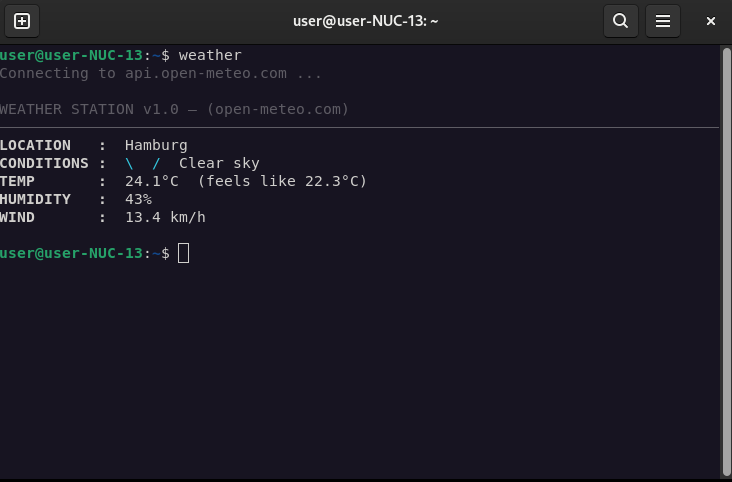
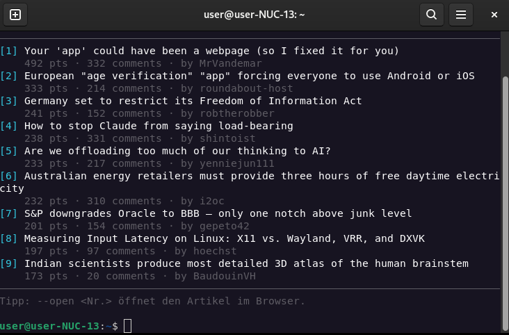
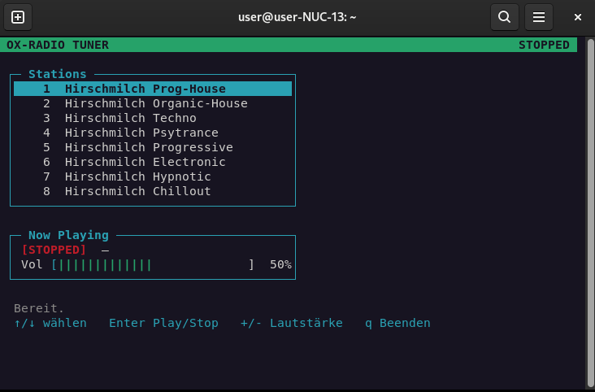
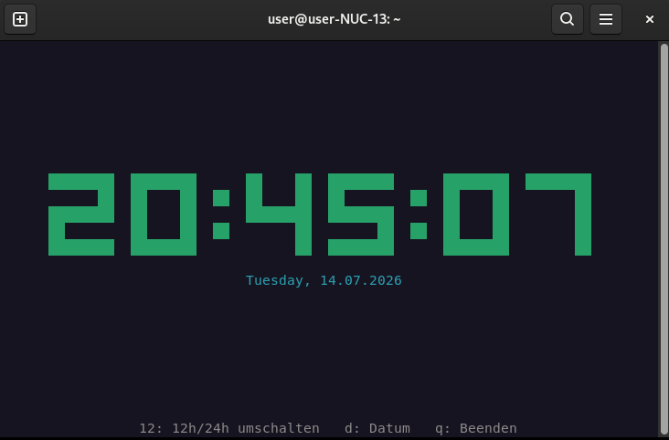
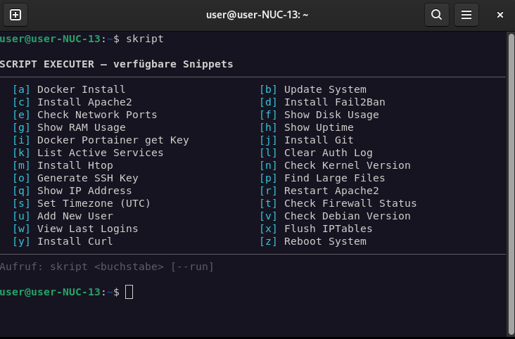
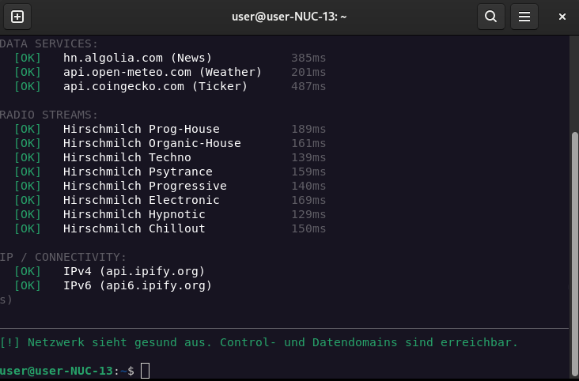
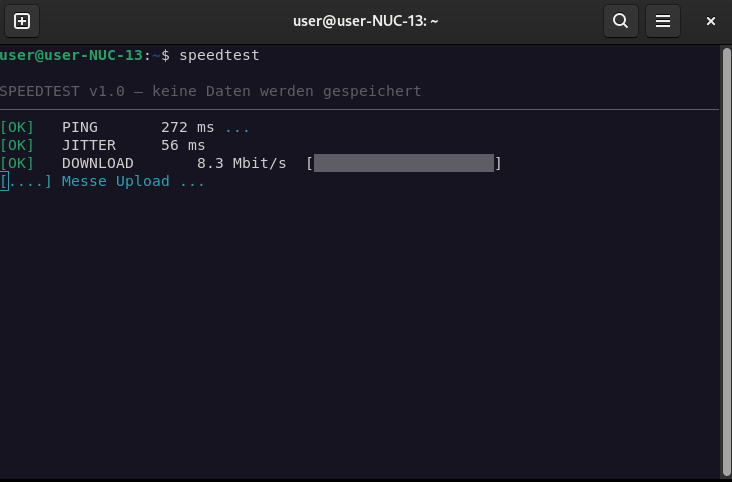
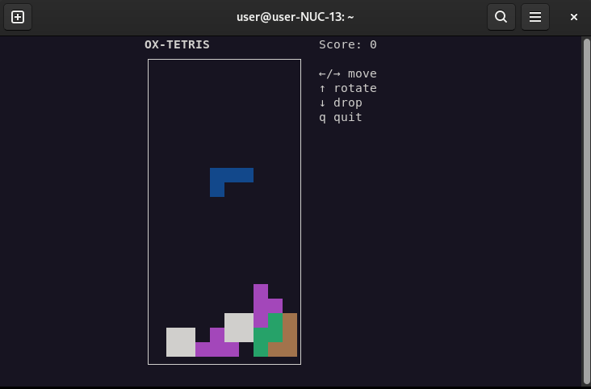
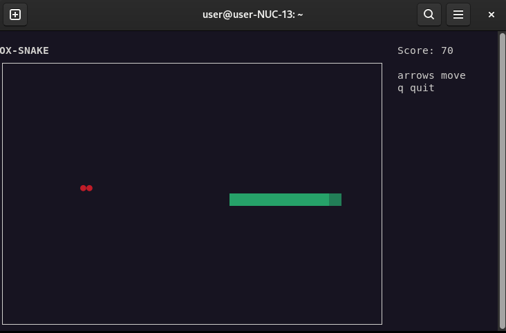
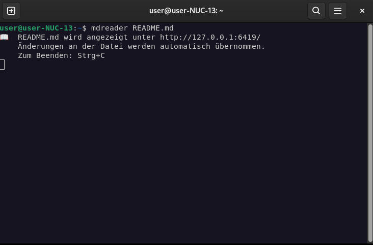

# oxpytools

Ten standalone terminal programs, ported from the `hmradio`, `weather`,
`news`, `clock`, `skript`, `nettest`, `speedtest`, `tetris`, `snake`
commands and the Markdown viewer of the hidden OXINON web terminal — now
as real command-line tools for Ubuntu/Debian, no browser required.

*(German original: [README.de.md](./README.de.md))*

The data sources are identical to the web version:
- **Weather**: Open-Meteo (`api.open-meteo.com`), same 6 cities
- **News**: Hacker News Algolia API (`hn.algolia.com`)
- **Radio**: the same 8 Hirschmilch streams (`xfer.hirschmilch.de:8001`)
- **Nettest**: the same 4 test groups (Control/Data/Radio/IP)
- **Speedtest**: ping via ipify, download/upload via speed.cloudflare.com
- **Script**: the same 26 sysadmin snippets (a-z)
- **Clock, Tetris, Snake**: purely local, no network connection
- **mdreader**: local live Markdown viewer in the browser

## Requirements

- Python 3.8+ (usually preinstalled on Ubuntu/Debian)
- `curses` (part of the Python standard library on Linux)
- `mpv` **only** for the radio tool:
  ```bash
  sudo apt update && sudo apt install mpv
  ```
- `xclip` (or `xsel`/`wl-copy`) **optional** for `skript`, so snippets can
  be copied to the clipboard:
  ```bash
  sudo apt install xclip
  ```

All other tools only need the Python standard library — no `pip install`
required.

## Installation

```bash
chmod +x install.sh
sudo ./install.sh
```

The script copies the programs to `/opt/oxpytools/` and creates short
commands in `/usr/local/bin/`, which are then available system-wide:

```bash
hmradio
weather
news
clock
skript
nettest
speedtest
tetris
snake
mdreader
```

> **Why `skript` instead of `script`?**
> `script` is already a standard system command on every Ubuntu/Debian
> install (package `bsdutils`, records terminal sessions). To avoid
> overwriting it, the sysadmin snippet tool here is called `skript`.
>
> **Note on `hmradio`:** the radio tool is deliberately called `hmradio`
> (instead of just `radio`), because the Debian/Ubuntu repo happens to
> have a package of the same name called `radio`. This avoids a collision
> from the start.
>
> `install.sh` automatically checks on every run whether one of the
> target names is already taken by an *other* system command, and skips
> installing that one command (with a warning) instead of overwriting
> something existing. Old `ox-*` commands from a previous install are
> removed automatically.

### Try it directly without installing

```bash
cd oxpytools
python3 weather.py
python3 news.py
python3 clock.py
python3 hmradio.py       # requires mpv (command after install: hmradio)
python3 skript.py
python3 nettest.py
python3 speedtest.py
python3 tetris.py
python3 snake.py
python3 mdreader.py README.md
```

## Usage

### weather



```bash
weather                # Hamburg, current conditions
weather tokyo          # a different city
weather -f             # including 5-day forecast
weather -w             # watch mode, auto-refresh every 5 min
weather -l             # list all cities
```

### news



```bash
news                   # HN front page
news -s newest         # newest stories
news -s ask            # Ask HN
news -s show           # Show HN
news --open 3          # open article #3 in the browser
```

### hmradio



Interactive TUI:
```
↑ / ↓      select station
Enter      play / stop
+ / -      volume (live, without interrupting playback)
q          quit
```

### clock
Large digital clock in the terminal:



```
12 / 2     toggle 24h / 12h display
d          show/hide date
q          quit
```

### skript



```bash
skript                  # list all 26 snippets (a-z)
skript f                # show snippet 'f' (Show Disk Usage), copy to clipboard
skript z --run          # show + confirm before running (here: reboot!)
```

By default it only copies to the clipboard (via `xclip`/`xsel`/`wl-copy`,
whichever is installed). With `--run`, the command is executed directly —
with a confirmation prompt, and an extra warning for the three
destructive snippets (clear auth log, flush iptables, reboot).

### nettest



```bash
nettest
```

Tests all four groups (Control/Data Services/Radio Streams/IP) in
sequence and prints the same diagnosis at the end as the web terminal.

### speedtest



```bash
speedtest
```

Measures ping, jitter, download, and upload against the same public,
CORS-open endpoints as the browser version (ipify, speed.cloudflare.com).
No data is stored.

### tetris
10×20 field, 7 classic tetrominoes, +100 points per cleared row:



```
←/→        move
↑          rotate
↓          soft drop
q          quit
```

### snake
30×20 field, +10 points per apple:



```
↑ ↓ ← →    direction
q          quit
```

### mdreader



```bash
mdreader README.md              # view in browser, live reload
mdreader README.md --port 8080  # use a specific port
mdreader README.md --no-browser # don't open the browser automatically
```

## Uninstall

```bash
sudo rm -f /usr/local/bin/{hmradio,weather,news,clock,skript,nettest,speedtest,tetris,snake,mdreader}
sudo rm -rf /opt/oxpytools
```
